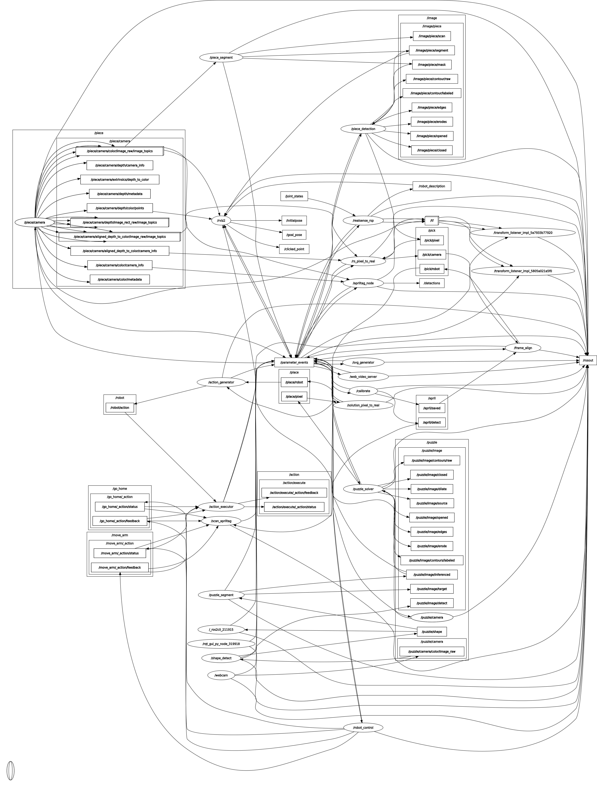

# Autonomous Tangram Solver

**Author:** Allen Liu

This repo contains the packages necessary for a robot arm to autonomously picks up tangram pieces and solves the tangram puzzle.

## Final Video

<!--  -->

<video src="https://github.com/user-attachments/assets/520b7747-861c-40a6-80e3-4880118254c8" controls></video>

## Install Dependencies

*Boost*

```bash
sudo apt install libbost-all-dev
```

*OpenCV*

```bash
sudo apt install libopencv-dev
```

*Armadillo*

```bash
sudo apt install libarmadillo-dev
```

*librealsense2*

```bash
sudo apt install librealsense2-dev librealsense2-utils
```

*ROS2 Iron*

Configure locale

```bash
locale  # check for UTF-8

sudo apt update && sudo apt install locales
sudo locale-gen en_US en_US.UTF-8
sudo update-locale LC_ALL=en_US.UTF-8 LANG=en_US.UTF-8
export LANG=en_US.UTF-8

locale  # verify settings
```

Add universe repo

```bash
sudo apt install software-properties-common
sudo add-apt-repository universe
```

Add ROS2 Key

```bash
echo "deb [arch=$(dpkg --print-architecture) signed-by=/usr/share/keyrings/ros-archive-keyring.gpg] http://packages.ros.org/ros2/ubuntu $(. /etc/os-release && echo $UBUNTU_CODENAME) main" | sudo tee /etc/apt/sources.list.d/ros2.list > /dev/null
```

Install ros dev tooks

```bash
sudo apt update && sudo apt install ros-dev-tools
```

Upgrade machine (Caution)

```bash
sudo apt update && sudo apt upgrade
```

Install ROS2 Iron Desktop

```bash
sudo apt install ros-iron-desktop-full
```

## Building all packages

Setup backages

```bash
export WORKSPACE=<path/to/your/workspace>

mkdir -p ${WORKSPACE}/src
cd ${WORKSPACE}
vcs import --input src < https://raw.githubusercontent.com/nu-jliu/Autonomous_Tangram_Solver/refs/heads/main/tangram.repos
rosdep install --from-paths src --ignore-src -r -y --skip-keys boost --skip-keys OpenCV
```

Build


```bash
cd ${WORKSPACE}
colcon clean workspace -y
colcon build --symlink-install --event-handlers console_direct+
```


 ## Launch the Program
To launch the entire software run the following command in a terminal

```bash
cd ${WORKSPACE}
source install/setup.bash
ros2 launch tangram_bot tangram.launch.py
```

Then the program will start by self-calibration. After you see robot arm moving out of the camera frame, you shall place the target tangram puzzle shape in the front of the camera, then run the following command, the robot will solve the puzzle automatically. 

```bash
ros2 action send_goal /action/execute tangram_msgs/action/ExecuteAction {} -f
```

## Software Architecture

The entire software architecture for the project is shown in the figure below, this diagram shows data is transmitted between ROS nodes.



### Packages

<!-- This software consists of 8 packages, which is described below:

 - `hand_eye_calibration`: Performs the hand-eye calibration steps for getting the positional relationship between the camera frame and the robot frame.
 - `image_segmentation`: Runs all vision models for this project to segment images using trained model.
 - `maxarm_control`: Performs the low-level position control of the robot arm.
 - `piece_detection`: Detects pose of all tangram pieces for solving the puzzle
 - `puzzle_solver`: Solving the tangram puzzle, generating the goal pose for each tangram pieces.
 - `tangram_bot`: Generate robot actions and execute the actions to pick and place tangram pieces to solve the puzzle.
 - `tangram_msgs`: All custom interfaces used for IPC (Inter-Process Communication)
 - `tangram_utils`: All library functions for tangram geometric calculations. -->

 The software developed for this project is composed of 8 interconnected packages, each performing a specific function to enable the robotic system to solve tangram puzzles. The packages are described as follows:

- **`hand_eye_calibration`**: Implements the steps for hand-eye calibration to determine the positional relationship between the camera frame and the robot frame.
- **`image_segmentation`**: Executes all vision models used in this project to segment images based on a trained model.
- **`maxarm_control`**: Handles low-level position control of the robot arm, ensuring precise movements.
- **`piece_detection`**: Detects the pose (position and orientation) of all tangram pieces required for solving the puzzle.
- **`puzzle_solver`**: Generates the goal pose for each tangram piece to solve the puzzle.
- **`tangram_bot`**: Generates and executes robot actions to pick up and place tangram pieces, completing the puzzle assembly.
- **`tangram_msgs`**: Contains all custom interfaces for **Inter-Process Communication (IPC)** between different system components.
- **`tangram_utils`**: Provides library functions for tangram geometric calculations, supporting operations like pose transformations and shape analysis.

